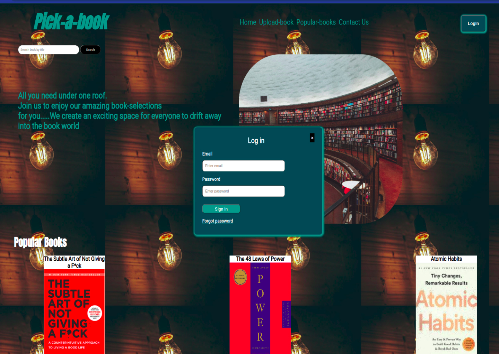

# Phase 1: Independent Project

## Pick-a-book

## Table of Contents

- [Description](#description)
- [Technologies used](#technology-used)
- [Setup](#setup)

- [Deployment](deployment)
- [Licence](#licence)
 - [Author info](#author-info)

## Description
Pick-a-book is a library website that gives readers a platform to access various books online. Moreover, it provides a review section where readers can share their thoughts, give feedback and like.Users also get a synopsis of the books selected.

For a user to access the website they have to log in.. 
 

## Technology Used
This website is created with:
  `
  * HTML
  * CSS
  * JavaScript
  * JSON
  `

## Setup
1. Clone this GitHub repository
2. Run json server
`
 (json-server --watch db.json)
`

## Deployment
The website is deployed in GitHub Pages

## Website Preview

## LICENCE
[MIT](Licence)
CopyrightⒸ 2022 B. Mududa.

## Author
[Barbra Mududa](barbra.mududa@student.moringaschool.com)

